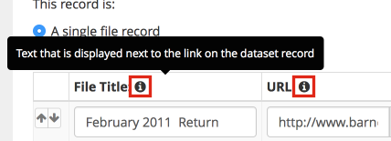
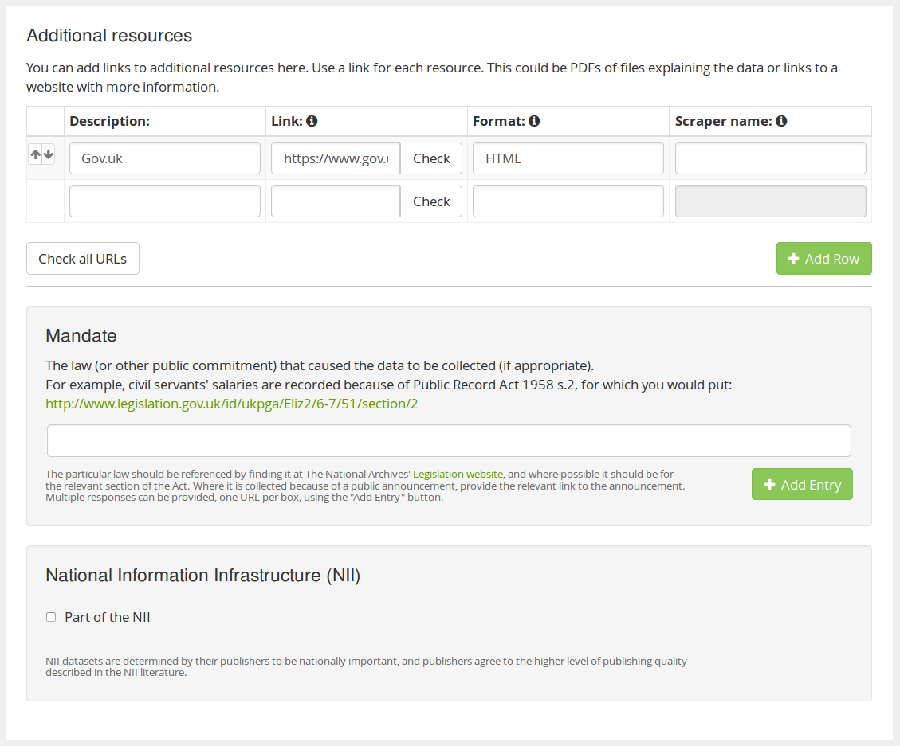

NB You can't use this method for publishing INSPIRE/Location data. See more [here](inspire.html).

# Add a dataset

1. Ensure you have a user account on data.gov.uk and it has been assigned permission for your organization, either as editor or admin. See: [Becoming an editor](becoming_an_editor_or_admin.html)

2. There are two methods:

   A. Click on the blue spanner icon and choose "Add a new dataset".
      

   B. Go to your publisher page and click "Add a new dataset".
      

3. Complete the form using the guidance [below](#form-fields-guidance).

4. Click 'Save and finish'. There is more about this [below](#form-submission).

# Edit a dataset

1. Ensure you have a user account on data.gov.uk and it has been assigned permission for your organization, either as editor or admin. See: [Becoming an editor](becoming_an_editor_or_admin.html)

2. Find the dataset you wish to edit and click "Edit dataset properties"
   

3. Complete the form using the guidance [below](#form-fields-guidance).

4. Click 'Save and finish'. There is more about this [below](#form-submission).

# Form fields guidance

### Add a dataset

The publication/editing wizard follows a tab structure. When creating new datasets you will have to click on next at the bottom of the wizard to continue.

### Naming the dataset

Think of a logical name for your record if you are creating a new one. Often it will need adjusting for data.gov.uk so that it makes sense to a layman. e.g. don't call it "Bathymetry survey 14a Dogger North 2011", call it "Sea bed scan, area 14a Dogger North". Leave the date off usually - put this in the resource title instead because there will likely be updates.

A URL for your dataset will be created from the name that you enter. 

If the generated URL is already used by another dataset then a warning will be displayed saying 'This URL is not available'. You can change either the name of the dataset to generate a new URL or manually change the URL until a unused value is found. Including the name of your organisation in the title is an easy way to make it unique.

### Information icons

Many fields have an 'information' icon, which displays more guidance if you hover the mouse over it.

### Timeseries vs Single File

It is very important that you select the right type of dataset. If you are publishing a dataset that will have updates across time (yearly, monthly, etc.) then make sure you select the timeseries option on the data files section. This will allow the date of the file to dictate the sorting, so the latest file is automatically presented on top and everything else falls in chronological order.

If you choose single file and then add subsequent publications, you will have to order them manually. *You should not select single file for datasets that will have new files across time*.

[Monthly datasets problem](monthly_datasets_problem.html)

### Data files

1. Choose whether you are creating a single file record (a record for a one off file) or a time series, for a single file...
2. Give the file a comprehensive title. Be succinct (i.e. Bird population in Essex by type)
3. Provide the link to the file, not to an html page, but to the file directly. Format will be added automatically
4. You can then check if the address is correct by using the ‘check url’ button or check all after you have finished adding the links
5. You can add more files (some returns, even if they are single may contain more than one file) by clicking the plus sign

### Time series

1. A time series record is for files that will have newer iterations as time passes (expenditure, cyclical data, etc.)
2. Give the file a comprehensive title, be succinct (i.e. Bird population in Essex by
type)
3. Provide the link to the file, not to an html page, but to the file directly. Format will be added automatically
4. You can then check if the address is correct by using the ‘check url’ button or check all after you have finished adding the links
5. Provide the date of the file, not the date you are uploading, follow the format suggested

### 'Check' button

The 'check' functionality allows the system to identify the format of the file and automatically add it to the record, avoiding chances of different spellings. The 'check all URLs' option allows you to check that the URLs entered are all active and working.

If you encounter problems when clicking the 'check' or 'check all URLs' buttons (no format appears in the format box or the check all URLs process takes too long ) don't use them. Manually enter the format of your file (which SHOULD always be CSV or another open format, NOT XLS, HTML OR PDF). This issue arises because some older browsers may not work well with this feature.

### Description and themes

Provide as much information about the dataset as you can, remember that the first few lines of this description will appear in search results

A primary and secondary themes are generated from the text entered in the description box. Click on the 'Update themes' link to generate them. The reasons why the themes were chosen will be listed. If you think that the themes are inaccurate, please expand the description to mention the topic of the dataset better.

### Licence

Leave as default unless the dataset is bound by a different licensing scheme (it should not as a rule). If other is chosen in the drop down you will be able to add details for the licence.

### Publisher

Select the publisher for this dataset to be published by from the drop down list. The contact details from our records associated with the publisher will be displayed. If the details are wrong you can modify them.

**Note: this feature is currently not working. The contact details associated with the publisher will not be displayed. However editing the details on this page will override the ones stored for the publisher.**

### Additional resources

Here you can enter links to any other document or page that provides more information on the dataset.

### Temporal coverage

Where available it is important to include the time period for the data. This may be a single date or a range of dates. If a single date is being entered please leave the second box blank.

The dates should be in the format DD/MM/YYYY, e.g. 21/03/2007. Optionally the date can include the time in the format HH:MM, e.g. 07:45 31/03/2006.

### Geographic coverage

It is also useful to include geographic coverage for the dataset. Use the checkboxes to select one or more areas which are covered by the data.

### Extras

This tab allows you to specify a number of optional extra metadata fields for the dataset, including a URL for a page discussing the dataset and a number of dates relating to the publishing and updating of the dataset.

# Form submission

## Form errors

When you click "Save and Finish", if there are problems with any field then it will list them at the top, and also with yellow warning triangles on the appropriate tabs, and when you click on the tab red sharded boxes say what the problem is next to the appropriate field e.g.

Occasionally new mandatory fields are added to the form. This can cause form errors to appear when you edit an existing dataset, even if you've not changed anything. In this case, fill in the new field to be able to save it successfully.

If, after clicking 'Save and finish’, you are still in the editing screen then: **YOUR CHANGES HAVE *NOT* BEEN SAVED!**

## Caching

The data.gov.uk site is cached for 1 hour for general users, but not if you are logged in. This means that if you add a dataset or make a change, you will see it has changed straight away, but it will take up to an hour before it becomes visible to another person visiting the site (i.e. someone who does not log in). Please be aware of this when notifying people or announcing releases.
