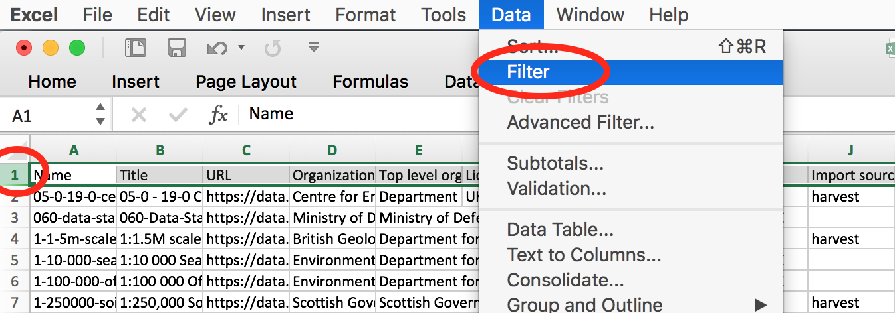
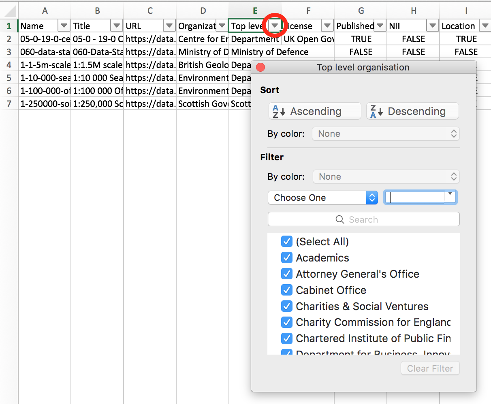
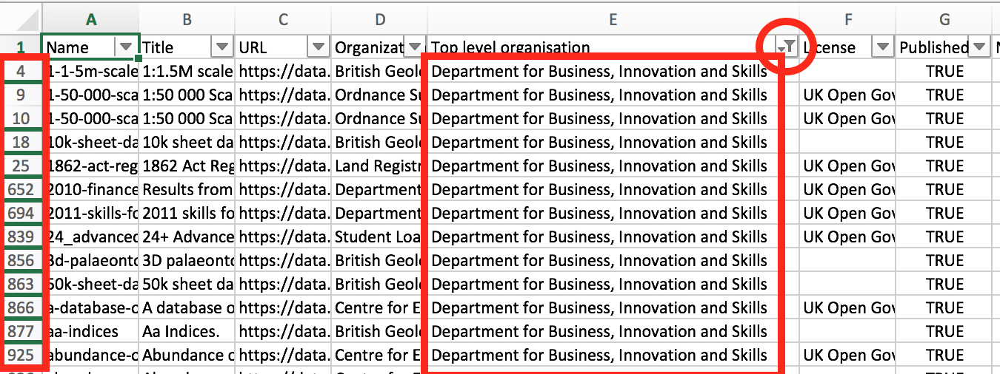

Every night the dataset catalogue of data.gov.uk is recorded as files, so that they are available in bulk and a record of changes time is built-up. These files are themselves data, and are catalogued here: <https://data.gov.uk/dataset/data_gov_uk-datasets>

There are three versions:

* JSONL "v2" format - contains all properties of the datasets. Extras are given as a list of sets.
* JSON format - contains most properties of the datasets - all apart from qa, archiver and harvesting. No "organization" details - just "owner_id". Extras are given as a set.
* CSV format - a zip of datasets.csv and resources.csv, with the main properties of each

These files are big and so we provide some hints of a few ways to use them.

## Use Excel/LibreOffice to filter & sort

datasets.csv opens in Excel or similar (give it a few seconds to load the 40k rows).

Select the first row (click on the "1" on the left side) and then from the "Data" menu select "Filter" or "Autofilter" (LibreOffice has it under "Data \| Filter \| Autofilter").

Now that 'Autofilter' is switched on, you should see in the first row each cell has an new icon - either a drop-down arrow or a funnel. You can click on these to reveal a drop-down panel which shows the values in that column and you can easily filter out rows containing particular values:

For example, click on the "Top level organization" filter icon. On the filter panel click "Select All" (or "All" in LibreOffice) to clear all the ticks against all the values listed, and then click on "Department for Business, Innovation and Skills" and then close the window ("OK" if it has it, otherwise the 'x' or red button in the top-left corner of the dialog box). This filter is on now, so all the rows which are not from this organization are hidden:

You can see from the row numbers at the far left that many rows are hidden, and in cell E1 the filter is shown as active by filter icon on the drop-down button (in LibreOffice it has a blue column heading and a dot on the drop-down button).

We can also add other filters at the same time, for instance we can filter out 'unpublished' datasets by setting the 'Published' column with a filter for 'True' values.

The autofilter is a bit transitory and working in a sheet with hidden rows is a bit problematic, so it is helpful to copy and paste all the cells to a new sheet. When you copy and paste it leaves behind the hidden rows, so you just get the ones you filtered for.

## Use 'jq' to extract selected fields

"jq is like sed for JSON data - you can use it to slice and filter and map and transform structured data." https://stedolan.github.io/jq/

To get started, [download jq](https://stedolan.github.io/jq/download/) and either the [JSONL dump](https://data.gov.uk/data/dumps/data.gov.uk-ckan-meta-data-latest.v2.jsonl.zip) or [JSON dump](http://www.data.gov.uk/data/dumps/data.gov.uk-ckan-meta-data-latest.json.zip) and unzip them.

Examples are below, but for more help, refer to the jq documentation: <https://stedolan.github.io/jq/manual/>

### JSONL dump

Show all the records in the JSON dump but prettified:

    jq . data.gov.uk-ckan-meta-data-latest.v2.jsonl

Show the first record prettified (uses sed to extract the line number and use jq to format it):

    sed -n '1,1p' data.gov.uk-ckan-meta-data-latest.v2.jsonl | jq .

Filter for all the records by CEFAS and create a CSV with columns for name, title, guid and metadata_modified using this command:

    jq '. | select(.organization.name=="centre-for-environment-fisheries-aquaculture-science") | [.name, .title, .extras.guid?, .metadata_modified] | @csv' data.gov.uk-ckan-meta-data-latest.v2.jsonl

### JSON dump

Show all the records in the JSON dump but prettified:

    jq . data.gov.uk-ckan-meta-data-latest.json

Show the first record prettified:

    jq ".[0]" data.gov.uk-ckan-meta-data-latest.json

Filter for all the records by CEFAS and create a CSV with columns for name, title, guid and metadata_modified using this command:

    jq -r '.[] | select(.owner_org=="2f1c6ccb-3f21-40c0-8b26-41566c53eb2f") | [.name, .title, .extras.guid?, .metadata_modified] | @csv' data.gov.uk-ckan-meta-data-latest.json
