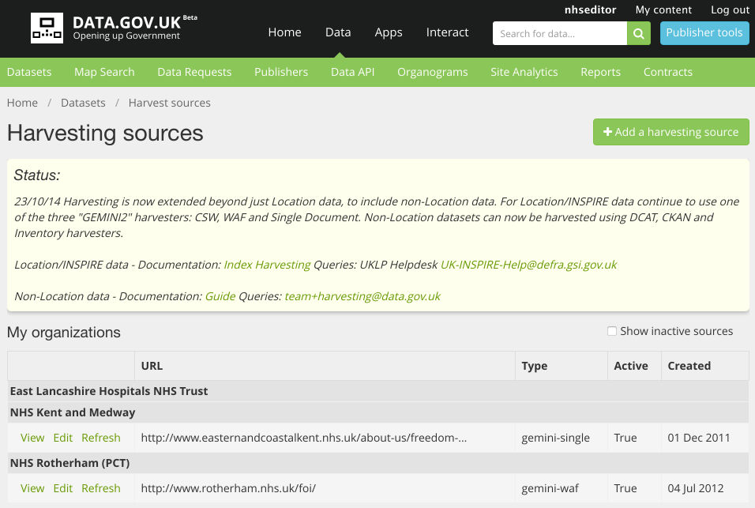
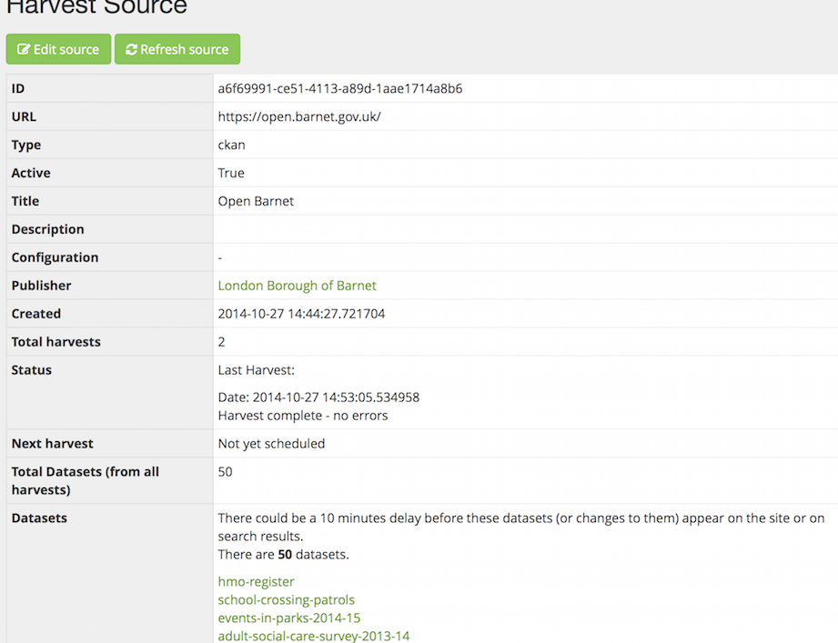
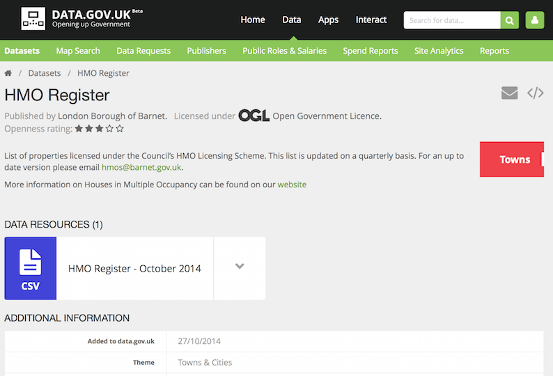
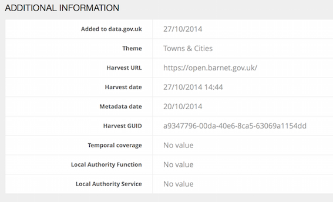
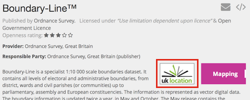
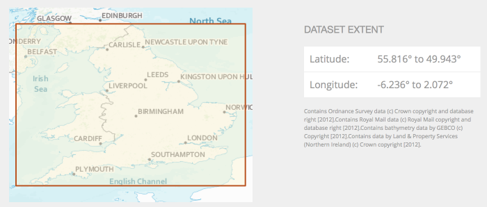
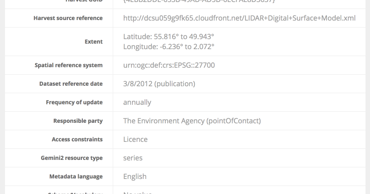

# Introduction

This guide explains how a public body can transfer its dataset listings in bulk into data.gov.uk. The dataset records (metadata) are listed by the public body on their open data website (or GIS system or UK Location Metadata Editor) and they then operate data.gov.uk's "harvester" to transfer them into data.gov.uk.

Most data (all apart from INSPIRE/Location data) can be added to data.gov.uk using the [web form](dataset_form.html), but bulk addition using the harvester offers a key advantage: it allows the publisher to store their dataset records on their own server, helping them keep it up to date as updates are published. Location/INSPIRE data has always been required to be harvested, whilst all other records have been able to be harvested since November 2014.

To work with the harvester, a public body's set of records are published on the internet in any one of the recognized formats. These formats represent the most common ones produced by 'open data websites' such as CKAN, DKAN, Socrata or DataShare, and Location/INSPIRE records are produced by the UK Location Metadata Editor, GeoNetwork or ArcGIS.

The launch of the non-Location harvesters in November 2014 was timed to support the Local Authorities to publish their metadata on data.gov.uk  about the datasets that local authorities are required to publish locally due to the [Local Government (Transparency Requirements) Regulations](http://www.legislation.gov.uk/uksi/2014/2680/introduction/made). Local authorities are also encouraged to publish their open datasets on data.gov.uk through the [Local Open Data Incentive Scheme](http://incentive.opendata.esd.org.uk/). Through a local government sector led approach, additional fields were requested and added by the LGA, such as function & service categories - these are imported by all of these harvesters. data.gov.uk is being enhanced to make good use of this extra metadata, to aid navigation by dataset type and automatically validate data against schemas.

# How to Publish Datasets

A public body may or may not have a open data web site, but to be harvested into data.gov.uk it needs to ensure it is published in a suitable machine-readable way.

Each dataset should be described in a "metadata record", giving details about the dataset, such as: title, description and web link to download the data file. The metadata records need to be published:

* in a machine-readable format that data.gov.uk recognizes - see section "Supported Formats"
* in a suitable place on the public Internet - probably the body's website or data portal

It is essential to understand if your data falls under the INSPIRE regulation - check with the [INSPIRE scope](inspire.html#inspire-scope). INSPIRE datasets must be published in GEMINI format. You can also publish other geo-spatial/location data in the GEMINI format. But you must not use GEMINI for data that has no location element.

## Supported Formats

| Harvester | Suitability | INSPIRE/Location | Example Harvest URL |
| --------- | ----------- | ---------------- | ------------------- |
| DCAT | Triple-stores | No | http://opendatacommunities.org/data.ttl |
| data.json | Socrata, custom systems | No | https://nycopendata.socrata.com/data.json |
| CKAN | CKAN | No | https://open.barnet.gov.uk/ |
| DKAN | DKAN | No | http://opendata.cambridgeshireinsight.org.uk/ |
| Inventory | DataShare | No | http://data.bracknell-forest.gov.uk/api/esdInventory |
| GEMINI - CSW Server | GeoNetwork, ArcGIS | Yes | http://metadata.bgs.ac.uk/geonetwork/srv/en/csw |
| GEMINI - Web Accessible Folder (WAF) | UK Location Metadata Editor, custom systems | Yes | http://www.ordnancesurvey.co.uk/oswebsite/xml/products |
| GEMINI - single file | Testing only | Yes | https://itportal.decc.gov.uk/web_files/gis/xml/DECC_ON.xml |

### DCAT

DCAT has the major advantage that it was designed in an open process by practitioners from around the world of data publishing and has become a W3C recommendation. It has been selected by the EU for the harvesting and republication of data from the 28 EU national data portals including data.gov.uk – the EU-wide portal is in beta and will launch in Autumn 2015. DCAT is also supported by the majority of data portals around the world, including the national government portals in US, Canada, Australia and the large numbers of others that use CKAN and other software.

DCAT is a 'vocabulary' in the RDF Linked Data world, and it is normal to use fields/predicates from other vocabularies where appropriate. Whilst this adds expressiveness, data.gov.uk cannot read every eventuality, so this document publishes the fields/predicates that data.gov.uk expects in: [DCAT/data.json fields](dcat_fields.html)

DCAT can be seen as somewhat verbose. Whilst it is ideal for linked data systems, it is often preferable to use a simplified version called data.json. The data.json format has the fields we need from DCAT, but removes the namespace prefixes and uses the well-known JSON syntax. This has the benefits of DCAT but is generally much more easily produced – see the section on data.json.

Although CKAN supports DCAT for the core fields, it is recommended to harvest from a CKAN using the CKAN harvester. This is because custom fields often do not map well to DCAT fields and can vary from portal to portal.

The DCAT harvester needs to be given the URL that returns the RDF for all the datasets. Optionally the datasets can be split into a number of pages, accessed using the 'page' parameter. i.e. page 2 would be accessed by appending to the URL: ```?page=2```

### data.json

The data.json format was designed as having the same fields as DCAT, but expressed more simply. It is used extensively for harvesting the American public bodies into data.gov and is gaining popularity elsewhere.

The fields are documented in [DCAT/data.json fields](dcat_fields.html).

The US government provide various tools <http://project-open-data.github.io/> and full details of their implementation (it is similar to the UK definitions): <http://project-open-data.github.io/v1.1/metadata-resources/>

The data.json harvester needs to be given the URL that returns a JSON list containing the datasets. Optionally the datasets can be split into a number of pages, accessed using the 'page' parameter. i.e. page 2 would be accessed by appending to the URL: ```?page=2```

### CKAN

The CKAN software is the most popular data portal software, powering the largest government portals in UK (including data.gov.uk), USA, Canada, Australia and much of Europe. It is open source, meaning there is no organization that can control functionality or usage. Numerous organizations and contractors offer services to administer, customize or host CKAN. The CKAN Association founded in 2014 provides a world-wide community.

Although most of the fields are core to all CKAN sites, it is common to customize fields. data.gov.uk has some customizations, so some translation of records occurs during harvest, and optionally extra metadata fields can be supplied that data.gov.uk will display.

The fields are documented in [Harvesting Guide Appendix B (PDF)](http://data.gov.uk/sites/default/files/library/Harvesting%20guide.pdf).

The CKAN harvester needs the URL of the CKAN home page, from where it can find its API functions.

### DKAN

DKAN is developed by a US-based consultancy and gives basic CKAN functionality. Although it aims for compatibility with CKAN APIs, as it stands (October 2014) the normal APIs for harvesting are not there, and some fields are expressed differently, so you'll need to use this custom DKAN harvester.

Follow the CKAN field guidance.

The DKAN harvester needs to be given the URL of the DKAN home page, from where it can find its API functions.

### Inventory

Developed for the LGA, this format is only suitable for local authority data and is implemented by DataShare. An XML schema is supplied by ESD for this harvester which checks the elements and basic types before being accepted by the harvester.

The CKAN harvester needs the full URL to the inventory XML file.

Full guidance for this format is here: <http://schemas.esd.org.uk/inventory/InventoryGuidance.pdf>

The schema is here: <http://schemas.opendata.esd.org.uk/Inventory>

### CSW Server (GEMINI)

CSW, or [Catalog Service for the Web](https://en.wikipedia.org/wiki/Catalog_Service_for_the_Web), is an open standard by the OGC, for exposing geo-spatial metadata on the web. It is full of features and complexity, so is most suitable for GIS systems like [GeoNetwork](http://geonetwork-opensource.org/) or ArcGIS.

Note: whilst in you can publish non-spatial data with CSW, data.gov.uk currently only accepts GEMINI2 metadata which does not support non-spatial data.

ISO19139/ISO19119 metadata and GEMINI2 are similar, but it is suggested you validate using the GEMINI2 schematron in your GIS before publishing to data.gov.uk, to spot any issues earlier in the chain.

CSW version 2.0.2 is the version required for INSPIRE & data.gov.uk.

There is more about CSW in the [Discovery Metadata Service Collection Information Specification (PDF)](http://data.gov.uk/library/discovery-metadata-service-collection-interface-specification)

### Web Accessible Folder (WAF) (GEMINI)

A WAF is simply a web page with links to GEMINI2 XML files. This means it is simple to implement such as placing your XML files in a folder on your server and tell Apache to server it with a directory listing.

There is an important caveat though - the HTML must not have a path specified in it - the XML files must therefore be at the same path (folder) as the HTML page. (This allows you to have other links on the web page, such as to your home page, which are ignored by the harvester.) When you look at the source of the WAF web page, it might be like this:

```
<html>
 <body>
  <a href="rivers.xml"/>
  <a href="fish-population.xml"/>
  <a href="nitrogen-levels.xml"/>
 </body>
</html>
```

Ensure the links do **not** have a path (i.e. have slashes) like this:

```
  <a href="/data/rivers.xml"/>
```

There is more about the WAF specification in the [Discovery Metadata Service Collection Information Specification (PDF)](http://data.gov.uk/library/discovery-metadata-service-collection-interface-specification)

### Single File (GEMINI)

If you only have one dataset record to publish, or just want to test a record without putting it in a CSW or WAF, you can point the harvester directly at the URL that returns the GEMINI2 record (XML file).


# How to Harvest

1. Ensure you have a user account on data.gov.uk and it has been assigned permission for your organization, either as editor or admin. See: [Becoming an editor](becoming_an_editor_or_admin.html)

   Once you've received admin/editor permission then when you log-in you'll see a blue spanner icon and your organization listed underneath when you click it. For example in this screenshot, this user has admin or editor permission for National Health Service and NHS England:


2. Create the harvester

   Click on the blue spanner icon and select 'Dataset Harvesting'.

   Now you should see the harvesting dashboard at <http://data.gov.uk/harvest>:
   

   Note that the harvesters are public, but because you are logged in as an editor/admin you have the ability to create a harvester and see the status of your harvesters. You also see a status message in the yellow box.

   To create the harvester click "Add a harvesting source" and fill out the form and click 'Save':
   

   Here is an example for a harvesting CKAN server:
   

   And here is an example for harvesting datasets from a DataShare that publishes Inventory XML:
   

   When you click Save it will show you your harvester's details and tell you that the harvest has now been requested.

3. Wait for the harvest and check the results.

   Harvests are started every 10 minutes, and take a few minutes more to complete. If you refresh the harvester's page it will tell you in the 'Status' and 'Last harvest' fields if the harvest is "scheduled" (i.e. waiting to start), "in progress" or when its complete it shows you the results of the "Last Harvest". (If you are not logged-in then status is not shown).

   A successful harvest will look like this:
   

   If you do get errors listed, then consult the section later on called "Harvest Errors".

4. Harvest again automatically or when your datasets need updating

   It is natural to configure the harvester's "frequency" to weekly or daily, to ensure it stays in sync with your metadata. Whether you do this or leave it as "manual", you can do another harvest by clicking the "Refresh source" button on the harvester page (remember to be logged-in to be able to see the button).


# Harvested datasets

A harvested dataset looks mostly like other datasets on data.gov.uk:


## Details of the harvest

When someone views a dataset that have been harvested, they see a few extra fields listed towards the bottom of the page:


The harvester has added: "Harvest URL", "Harvest date" and "Harvest GUID". The GUID is the dataset's ID as it was in the harvested system e.g. the CKAN "id", DCAT URI or the Inventory "inv:Identifier".

Not all of the publishing sources or harvesters cover all the fields, so for example Temporal Coverage operates differently in the Inventory format, and the DCAT harvester doesn't include it yet. We hope to fill in these gaps in time.

## Format field

The 'format' (e.g. CSV or WMS) of a data resource can be specified easily in most harvesters, but it is tricky for Location/INSPIRE records.

There is a fundamental problem with the GEMINI2/ISO19139 format used by Location/INSPIRE records, in that although it stores a list of data URLs (resource locators - gmd:transferOptions) and a list of formats that the data is available in (gmd:distributionFormat), there is no connection between these two lists. So you can't say which resource locator returns a particular format. So to get round this problem, we allow you to record the resource locator's format, by using a carefully formed 'name' field.

However data.gov.uk does need to know which URL is for a WMS server, so that it can offer previews. So on harvest (of GEMINI2 documents), data.gov.uk will make a call to each URL as if it was a WMS server, and if it appears to respond correctly, it will record the format as WMS. Failing that, the format will be left blank.

## Location/INSPIRE differences

Records for Location/INSPIRE (i.e. from GEMINI2 metadata) are identified by the UK Location logo:



All Location/INSPIRE records have a map with a box showing the spatial extent.



The GEMINI2 record (and an HTML version) are provided:


And Location/INSPIRE records have extra fields in the Additional Information:



## Five Stars of Openness


Datasets on data.gov.uk are automatically given an 'Openness rating' that gives a simple indication of how well the dataset has been made open. For more about this system, see [Five Stars of Openness](five_stars_of_openness.html).

A low star rating can indicate problems with the dataset record - maybe the URL to the data was mistyped, or only goes to a web page about the data. Or maybe the harvester has not transferred the details accurately from your site - [contact us](http://data.gov.uk/contact) in that instance. These are easily fixed and then you reharvest.

## Theme


The 'theme' of a dataset is automatically set on harvest. For more information, see [Theme](theme.html).

# Harvest Errors

It is not unusual to see errors on the first harvest. Often it is simple to put right, either in the harvester configuration or it has revealed problems with how the datasets are published. Here are some error messages and tips for solving them:

* **Unable to get content for URL** There was some sort of connection error contacting the publishing site, or the publishing site gave an error for this URL. Check you've configured the harvester with the correct type and URL to go with that type. Some harvesters need the home page of the site, and some need a specific sub-url. Very occasionally these errors are just down to the internet being unreliable.

* **Failed to parse or validate the XML document** There is something wrong with the structure of the returned content. If source type is 'Inventory', then check that the URL is actually an Inventory XML file and validates against the Inventory schema for the correct schema version, which is given on the harvester edit page.

* **System error** / **Validation Error** Something has unexpectedly gone wrong internally data.gov.uk. Please [contact](http://data.gov.uk/contact) the team to fix the problem.

* **The contents of document with GUID xyz changed, but the metadata date has not been updated.** There is a rule that a GEMINI2 record must have its date (gmd:dateStamp) updated with any change to the rest of the record. This allows the record to be distributed to many different systems, and when harvested to data.gov.uk it can tell which is the most up-to-date version. This error can also be seen where the record's GUID/gmd:fileIdentifier has incorrectly been copied to another record.

* **Couldn't find any links to metadata files.** Check the harvest URL returns a web page with links to the metadata. Then check there source of the web page - it is likely the problem is that the links' href fields contains slash characters `/` and they must not. This is explained above in the section above about WAFs.

* **This element is not expected** In a GEMINI document, the XML elements must come in a particular order, and your document might have this wrong. Other explanations for this error include adding elements that are not recognized. If they are produced by a GIS server, check that they follow the GEMINI 2.1 schema, rather than vanilla ISO19139 or other similar format. Otherwise, check your fields and ordering against those in the [GEMINI Encoding Guidance](http://data.gov.uk/library/uk-gemini-encoding-guidance) - Appendix A.

Other common Location/GEMINI specific errors are covered in the [Common Metadata Errors Guide (PDF)](http://data.gov.uk/library/common-metadata-errors-guide).

Hopefully the detail of the error messages and these hints provide enough information to solve the issues. If something is still not clear, or data.gov.uk is not working as it should, please [contact us](http://data.gov.uk/contact).

# Local Authority data schemas

The Local Government Association (LGA) has released schemas for key datasets, for example Public Toilets and LA Spend Transactions. When publishing metadata on these datasets, Local Authorities should include the URL for the schema that it uses. This allows users to understand the format of the data. It also allows them to do basic validation that the file is formatted correctly. Indeed data.gov.uk intends to provide an automatic checking service, to validate the data files against the schemas.

The schema should be referred to in the metadata by the URL which downloads the schema file. (Rather than the URL to a web page about the schema, which is not machine-readable.) ESD is looking to improve the process to get the URL, but currently you need to follow these instructions:

1. Browse to the schema page in Firefox or Chrome. e.g. for Spend data it is:
<http://csvchecker.opendata.esd.org.uk/spend>

2. Fill in the form saying what options you have chosen for the fields that have options

3. Open the developer toolbar and click on the 'Network' tab/ (i.e. enable it to record the network requests)

4. On the web page press "Validation File". (You should get a download dialog box - ignore it)

5. In the Network tab you'll get a list of URLs loaded - its the first one you need. Copy and paste it into the correct field, which is "conformsTo" (data.json/DCAT/Inventory) or "schema_url" (CKAN).

It should look a bit like:
```http://csvchecker.opendata.esd.org.uk/schema/downloadjsonschema?schemaId=spend&majorVersion=0&requiredFieldIds=```

