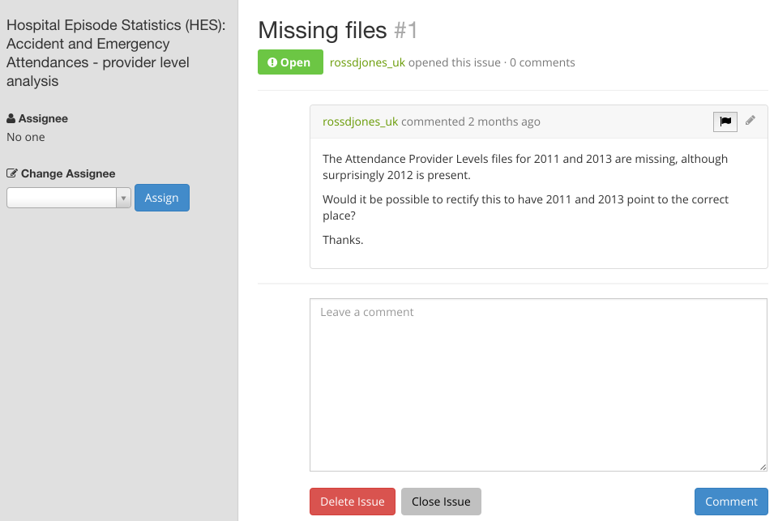

# Overview

Members of the public can raise 'issues' against datasets on data.gov.uk. This allows them to communicate problems to publishers, such as corrupt data files, missing updates or insufficient documentation.

It is a public process to avoid users raising duplicates and to be transparent about publisher efforts made to resolve them.

The issues functionality was trialled with a few departments from October 2015 - January 2017. Further work is envisaged, but for now the functionality is mostly disabled. Currently, only the few datasets with an existing issue are active.

# Tour

Towards the bottom of a dataset page you will find a list of the dataset's issues:

Click on an issue to see the full description and comments made by both the end user and the officials from the publisher:

Any user of data.gov.uk can create an issue by clicking "New Issue" on a dataset page and then completing the form:

Emails are sent to the admins & editors of the publisher of the dataset, who can make comments. When the issue is resolved they can mark it as "closed".

# How should the publisher deal with issues?

1. Assign

   When you're notified of an issue, since there are often a number of people responsible it is a good idea to 'assign' someone in particular to deal with it. (This is optional.)

   

   The assignee is kept hidden to the public, who see only the publisher (organization) name.

2. Comment early and often

   It's a good idea to comment straight away, saying that the issue has been received and a response will be forthcoming. This reassures the public that it is being dealt with, even though it may take a few days to establish if it is a genuine problem or not.

   Once you've looked into the issue, even if you haven't solved it yet, if it's been a few days since you last commented on it then it is good practice to comment at this point, even if it is just to say that the issue appears valid but you will need some time to resolve it.

3. Sort out the issue

   Often you will resolve the issue by adding information to the dataset record - perhaps an extra Data File or an explanation in the description. If you only provide the explanation in the Issue comments, then future users of the dataset are unlikely to see them.

4. Close the Issue

   Now you've said what you've done, or explained why it isn't an issue, you can mark it as 'Closed' by clicking "Close issue". NB you have to have some text in the Comment box when you click "Close issue" - if you've already explained in a previous comment, then just write "Closing" in the box before clicking "Close issue".

# What notification emails are sent?

Notification emails go to the admins and editors of the publisher (organization) to whom the dataset is associated, as well as the person who raised the issue. In the future we plan to allow users to opt-out of these emails, but for the time being, all those that are involved in publishing will get these very occasional emails and ensure no important issues are missed.

Emails are sent when an issue is created, commented-on or closed.
