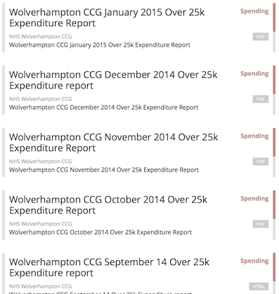
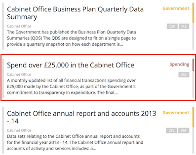
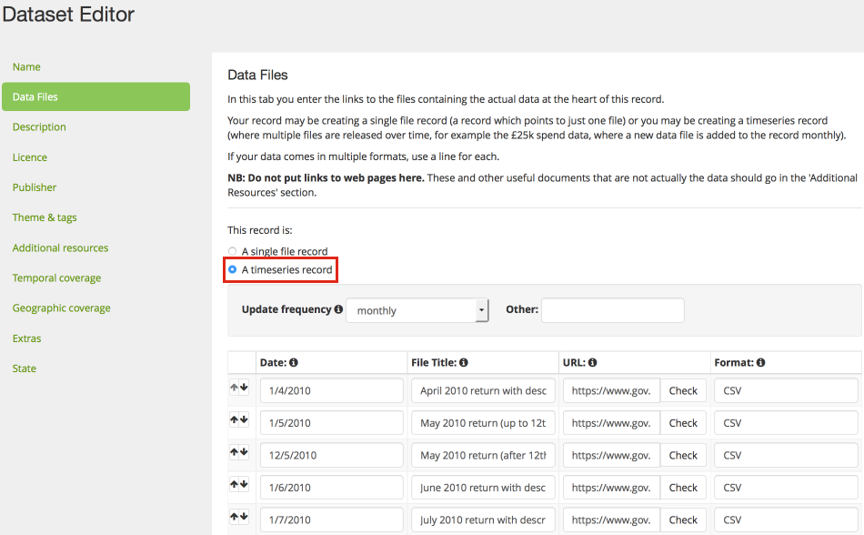

## What is the problem?

Many publishers are creating a new 'dataset' in data.gov.uk for every monthly update of some data, which is now considered bad practice. It is particularly common for the £25k spend data. You can see it floods the search page:

## How can it be done better?

Create just one 'dataset', and all the months of data are linked form within it. You can see other datasets clearly in the [search results](https://data.gov.uk/data/search?q=cabinet+office+spend):

And all the links are handily together on the [dataset page](https://data.gov.uk/dataset/financial-transactions-data-co):

In addition, it tidies away previous years' data to make the page manageable. Many users will still want access to the historical data and they can reveal it by clicking on the year.

This is a far better experience for users and is actually an easier process for the publisher to update.

## How do I do that?

When you create the dataset, on the 'Data Files' tab:

1. Select "A timeseries record". This adds the "Date" column to the table below.

   

2. Select the correct "Update frequency".

3. Fill in the table. Each row corresponds to one month, with the unique URL for that month's data.

   

   In the "Date" column add the date that the download refers to. A top tip for monthly data is to type in just the month e.g. type "6/14" for June 2014. Or data applying to a particular year, just put the year e.g. "2014". i.e. you don't have to click on the calendar that pops up.

   In the "File Title" column you don't need to repeat the date if the date field is clear. You could just put "Monthly spend data" for every row.

   NB You don't need to put them in order with the arrow buttons - a time series will display in the correct order automatically.

4. Click 'Save and finish'.

When a new month's data comes out you simple [Edit the dataset](dataset_form.html#edit-a-dataset), click on the "Data files" tab and fill in a new row. Finally click 'Save and finish'.

## What about converting lots of datasets?

NB As of September 2015, the data.gov.uk team has developed a semi-automatic tool to merge datasets together into a time series. It has been [run on all publishers that had spend data spread across multiple datasets](https://data.gov.uk/blog/tidying-time-series-data), and publishers informed individually. You can also ask for other datasets to be merged in this way - to do this [contact](https://data.gov.uk/contact) us with the URLs of the datasets to merge.

Alternatively, to manually merge datasets:

1. Create a new dataset that will be the timeseries (don't try and convert an existing dataset because that will have a month/year embedded in its URL).

2. In a separate browser tab or window, find the monthly data URLs and copy and paste them into the new datasets form.

3. Ask the data.gov.uk team to delete the old datasets. Use the [data.gov.uk Contact](https://data.gov.uk/contact) form. Explain that you've aggregated several datasets into a new timeseries one, providing the link to it, and that you want the old ones deleted.
