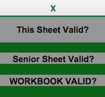

The Prime Minister committed central government and agencies to publish organograms of all staff positions from October 2010. The data includes the hierarchy of senior staff, including names, grades, job titles & salaries and numbers of junior staff that report to them.

Prime Minister's letter: [Letter to government departments on opening up data, May 2010](https://www.gov.uk/government/news/letter-to-government-departments-on-opening-up-data)

## Which bodies are required to do this?

The guidance applies to all bodies within central government as classified by the Office for National Statistics. This includes:

 * departments
 * non-ministerial departments
 * agencies
 * NDPBs
 * trading funds
 * NHS bodies - CCGs, Trusts, Foundation Trusts, SHAs
 * research councils

The ONS classifications can be found the "index" tab: [Public Sector Classification Guide, September 2015 (Excel)](http://www.ons.gov.uk/ons/rel/na-classification/national-accounts-sector-classification/classification-update-and-forward-workplan--september-2015/rft-table-1.xls)

There are a limited number of exceptions to the requirement to publish:

 * intelligence agencies
 * Financial and Non-Financial Public Corporations
 * Parliamentary Bodies

NB Local authorities publish their senior staff data in a different format - see the LGA guidance: http://schemas.opendata.esd.org.uk/OrganisationStructure

## Timing

The data is collected twice a year - snapshots of the roles on 31st March and 30th September, to be published on data.gov.uk by 6th June and 6th December respectively.

## Published data

Organograms are published at <https://data.gov.uk/organogram/>. The web interfaces includes a drop-down to select different organizations, a "Version" slider to select releases for the data at previous time snapshots and a "Sources" button for links to the Linked Data API, which is a web interface offering navigation through and chunks of the data in RDF serializations.

## About the data

### Senior roles

SCS pay band 2 (or equivalent) and above - name of the person, base pay (in £5k pay bands), grade, unit, contact phone/email, job title, role reported to, full time equivalent (FTE), salary cost of reports, professional/occupational group.

SCS pay band 1 (or equivalent) - same as for SCS 2, but without the base pay (which is included in the cost of team reports).

### Junior roles

Below SCS 1 (or equivalent) - unit, senior role reported to, grade, payscale range, generic job title, number of posts in FTE, professional/occupational group.

### Schemas

data.gov.uk provide schemas for the senior and junior CSV files. These describe the fields in greater detail and allows for some automated validation of the files.

  [Organogram schemas by data.gov.uk](https://github.com/datagovuk/schemas/tree/master/organogram)

## Publication process

The Cabinet Office provides departments with an Excel template file, which is completed with the data (according to guidance <http://data.gov.uk/sites/default/files/Organogram%20Visualisation%20Tool%20v1.0_10.pdf> ) and is then submitted into the data.gov.uk Organogram Tool. This system performs validation, ensures salaries are rounded to the nearest 5k and converts the data into RDF format. The RDF is put into the organogram triple store (for SPARQL queries) and served in the Linked Data API.

Publishing organisations should [contact the data.gov.uk team](http://data.gov.uk/contact) to obtain the Excel template and details of the upload into the data.gov.uk Organogram Tool.

In the near future, the CSV data will be provided for download in dataset records in data.gov.uk automatically. So far, several organizations have provided their own copies of the organogram data in CSV format on data.gov.uk and gov.uk manually.

## Publication FAQ

#### Can I publish data for past periods?

Not at the moment. We should be able to though in the new system, so keep hold of the data for the moment.

#### How do I fix an "invalid" spreadsheet?

"The spreadsheet is invalid. Please check your data and try again."

If you upload your Excel file and get this error then it means that there is a problem with one or more lines of the spreadsheet.

To work out exactly where the problem is, open the file in Excel and look on the "(final data)-junior staff" sheet. Scroll to the right-hand edge and there will be three coloured indicators.

First look at the last indicator 'WORKBOOK VALID?' - green means the file is all ok, or red means there is a problem.

If there is a problem then consult the other two indicators above. Red colours indicate whether the problem is in this sheet ("(final data)-junior staff") or the Senior sheet ("(final data)-senior staff").

For each sheet which has the problem, check the end of each row, where the column is titled "Valid?". Search for the row with the red colour and fix the problem in that row.

Some versions of the spreadsheet help you further by highlighting red the cell with the problem. And some versions have an extra column called "Invalid cell (Excel 2011+)" which tells you the column with the problem, but it only works in Excel 2011 and later.

Once all problems are resolved and the 'WORKBOOK VALID?' indicator has gone green and you still get an error when you try to upload it, then [contact us](http://data.gov.uk/contact), supplying the file in question.

#### Why hasn't our organogram appeared?

Here is a check-list for when you've uploaded organogram data and don't see it appear at <http://data.gov.uk/organogram/>.

* Check you are looking at the right Department/Public body.

  

  To be sure, select it again using the first box pictured - "Departments". The name of the department/public body should appear in the second box/button.

* Check you are looking at the right "Version" (date) in the viewer.

  

* Check that you changed the state to "Published" (via "Signed off") in the "Preview" screen.

  

* Ensure that you waited until at least the next day since you changed the state to "Published" (it is done during the night).

If you are still not seeing it, then [contact us](http://data.gov.uk/contact).