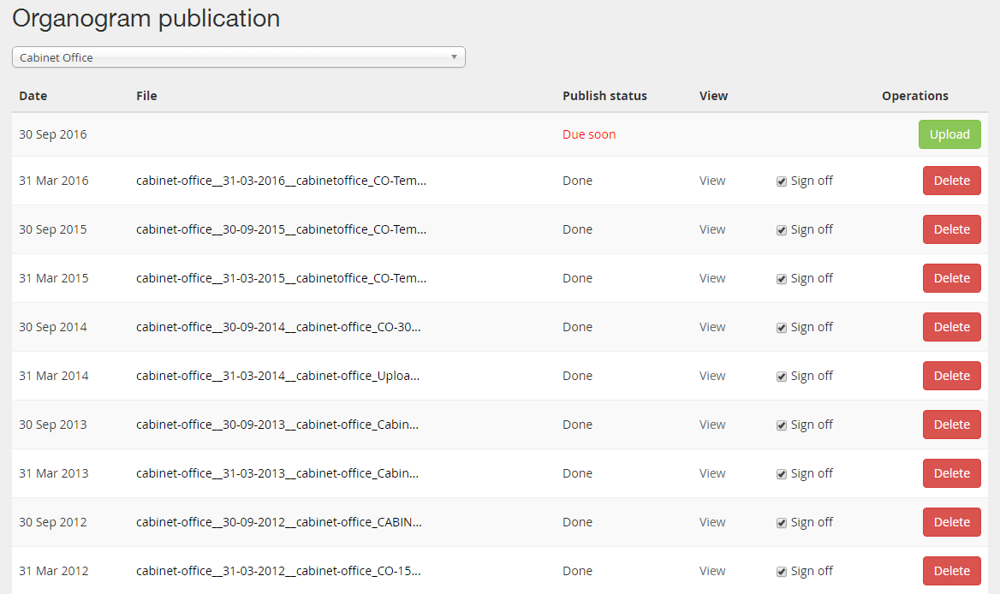
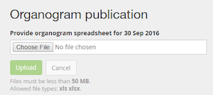
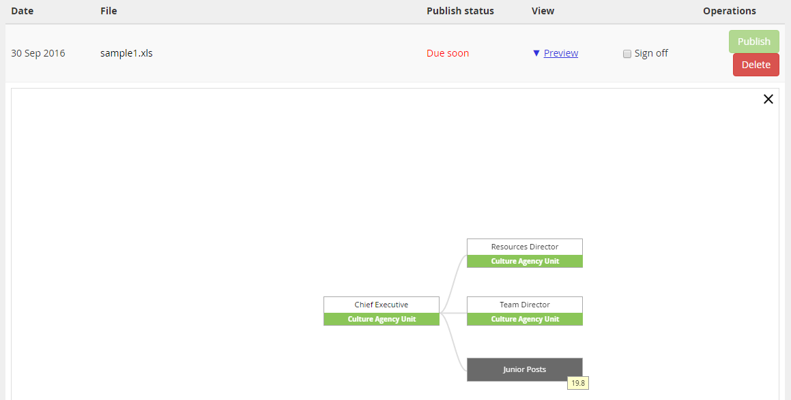
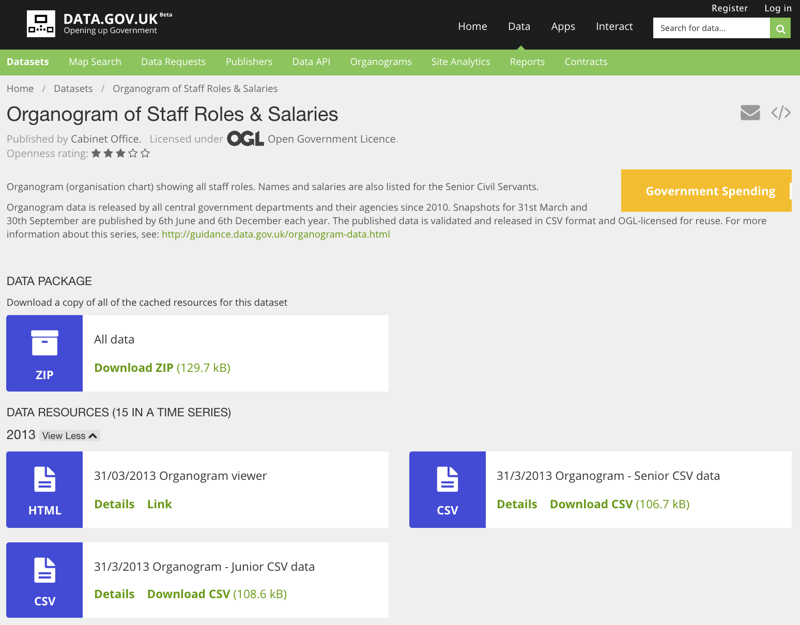
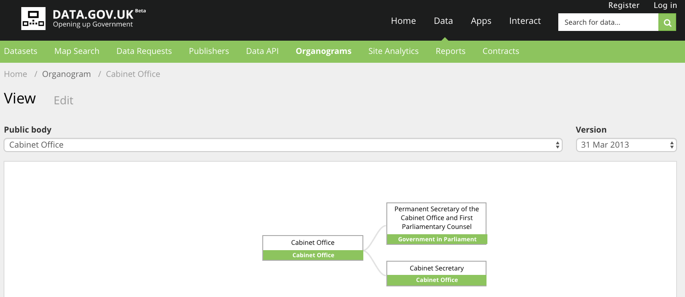

You can now (from 3rd October 2016) upload organogram data (sometimes called ‘organogram returns’) to data.gov.uk.

Before you start, you must:

* [read our guidance] to find out what data your organisation must publish
* get a copy of the previous organogram spreadsheet or download a fresh [spreadsheet template]
* fill out the spreadsheet with your organization data

## Get an editor account on data.gov.uk

Publishers need to get themselves an account on data.gov.uk and apply for 'editor' or 'admin' permissions added to it. To avoid delays when you come to upload the next set of data, please do this in advance.

1. Log in to data.gov.uk <https://data.gov.uk/user>. Or if you don’t have an account, [create an account](becoming_an_editor_or_admin.html#getting-an-account)

2. Check if your account has ‘editor’ permissions for your publisher by looking for the blue 'Publisher Tools' button at top-right. If you have it, click on it and check your organization is listed.

   

3. If you don’t have the ‘Publisher Tools’ button, or your organization isn’t listed in its drop-down, [request to become an 'editor'](becoming_an_editor_or_admin.html#become-an-editor).

4. If you requested to become an editor and haven’t heard back for a couple of days, [contact the data.gov.uk team].

## View your organograms

1. Sign in to data.gov.uk.

2. Click the ‘Organogram publication’ link at the top of your profile page.

3. Find your organisation in the list of publishers and select it.

4. You’ll be able to see every organogram your organisation has published on data.gov.uk so far, including those that will need to be published soon or should’ve been published already

## Uploading and publishing a new organogram

1. Find the organogram you need to publish in the list. They’re ordered by date with the most recent at the top of the list.

2. Click the ‘Upload’ button next to it.

   

3. Find the completed spreadsheet file on your computer and click ‘Upload’. If you get an error message, see: [Problems with uploading organograms](#problems-with-uploading-organograms).

   If successful, you’ll be sent back to the ‘Organogram publication’ page when your file is uploaded.

   

4. You can see how the organogram will look when it’s published by clicking the ‘Preview’ link.

   

5. You must tick the ‘Sign off’ box before you can publish the organogram. Only do this when senior approval has been given - for departments that would be from your minister or permanent secretary.

    Note: In the previous system the preview was made available as a separate web page, with a link that could be distributed without requiring log-in. This is no longer the case. This pre-publication preview can only be seen while logged in as a publisher.

6. You’ll now be able to click the ‘Publish’ button.

   

   The file will be added to your organisation’s organogram dataset on data.gov.uk:

   

   The diagram is under the "Organogram viewer" Link:

   
   

## Updating an existing organogram

1. Find the organogram you need to update in the list.

2. Click the ‘Delete’ button next to it. This will remove the file from data.gov.uk.

3. You can now upload the updated file. Find the completed spreadsheet file on your computer and click ‘Upload’. You’ll see an error message if there’s a problem with the file you’re trying to upload.

4. You’ll be sent back to the ‘Organogram publication’ page when your file is uploaded. You can see how the organogram will look when it’s published by clicking the ‘Preview’ link.

5. You must tick the ‘Sign off’ box before you can publish the organogram. Only do this when your minister or permanent secretary has approved the organogram.

6. You’ll now be able to click the ‘Publish’ button. The file will be added to your organisation’s organogram dataset on data.gov.uk.

## Problems with uploading organograms

You won’t be able to upload your organogram to data.gov.uk if there are any errors in your completed spreadsheet template.

When you’re filling it in, make sure:

* use the drop-down for the columns which have it, eg 'Parent Department' or 'Grade'
* roles don't report to themselves
* roles don't report to a role that is eliminated
* the Valid? column is green for every row

Check your spreadsheet and try to upload it again. Please refer to the guidance, which explains in detail how to complete every column. If you’re still having problems, email <team@data.gov.uk> with ‘Organogram issues - help’ in the subject line.